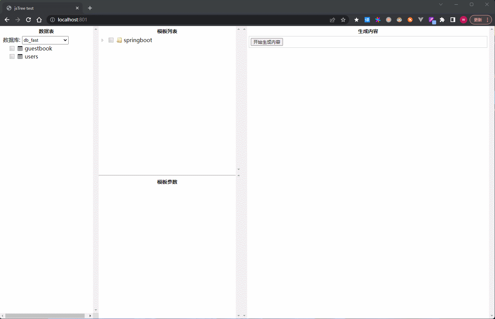

## TemplateCoder
一款代码生成工具，可自定义模板生成不同的代码，使用php作为模板引擎, 数据源支持MySQL、Sqlite、SQL Server、PostgreSQL。使用简单，可快速生成代码并保存到指定目录，减少重复劳动。
## 使用方法
1. 安装运行环境, 可以使用phpstudy, 参考[phpstudy安装](https://www.xp.cn/download.html)
2. 部署项目, 将项目放到phpstudy的www目录下
3. 配置数据库连接, 修改`config/database.php`文件
4. 打开浏览器, 访问`http://localhost`或配置的域名和端口

## 项目结构
```
api         接口目录
config      配置目录
    database.json    数据库配置文件
dist        前端资源文件目录
template    模板目录, 在此目录下添加自定义模板文件
vendor      php第三方库目录
index.html  入口文件
```
## 使用示例

